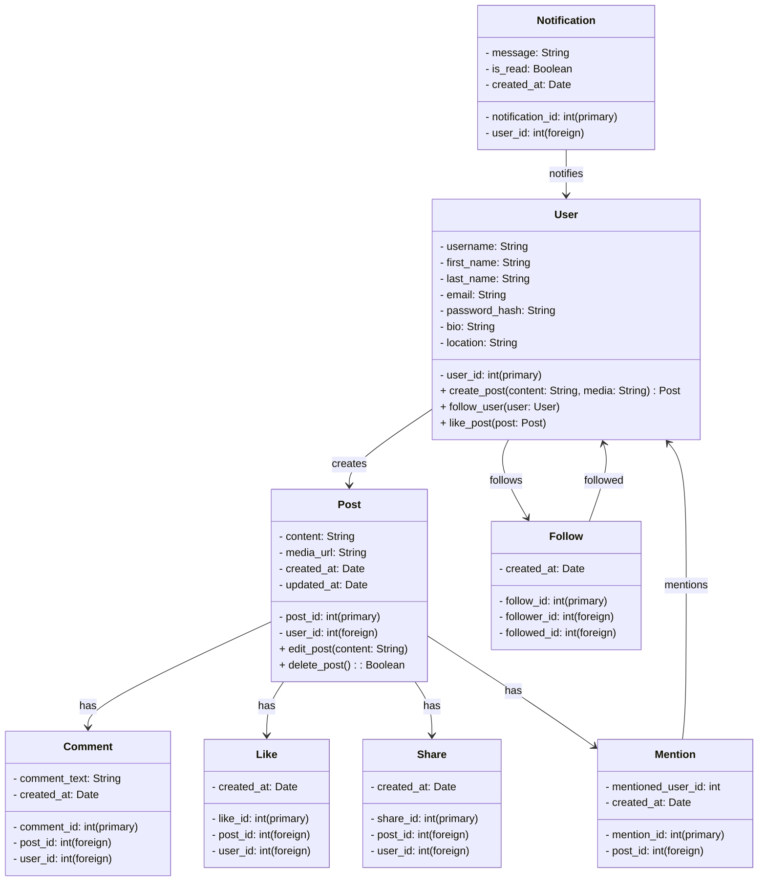

```mermaid
classDiagram
    class User {
        - user_id: int (primary)
        - username: String
        - first_name: String
        - last_name: String
        - email: String
        - password_hash: String
        - bio: String
        - location: String
        + create_post(content: String, media: String) Post
        + follow_user(user: User)
        + like_post(post: Post)
    }

    class Post {
        - post_id: int(primary)
        - user_id: int(foreign)
        - content: String
        - media_url: String
        - created_at: Date
        - updated_at: Date
        + edit_post(content: String)
        + delete_post(): Boolean
    }

    class Comment {
        - comment_id: int (primary)
        - post_id: int(foreign)
        - user_id: int(foreign)
        - comment_text: String
        - created_at: Date
    }

    class Like {
        - like_id: int(primary)
        - post_id: int(foreign)
        - user_id: int(foreign)
        - created_at: Date
    }

    class Share {
        - share_id: int(primary)
        - post_id: int(foreign)
        - user_id: int(foreign)
        - created_at: Date
    }

    class Follow {
        - follow_id: int(primary)
        - follower_id: int(foreign)
        - followed_id: int(foreign)
        - created_at: Date
    }

    class Notification {
        - notification_id: int (primary)
        - user_id: int(foreign)
        - message: String
        - is_read: Boolean
        - created_at: Date
    }

    class Mention {
        - mention_id: int(primary)
        - post_id: int(foreign)
        - mentioned_user_id: int
        - created_at: Date
    }

    

    User --> Post : creates
    Post --> Comment : has
    Post --> Like : has
    Post --> Share : has
    Post --> Mention : has
    User --> Follow : follows
    Follow --> User : followed
    Notification --> User : notifies
    Mention --> User : mentions
    

```

